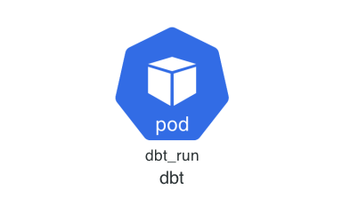
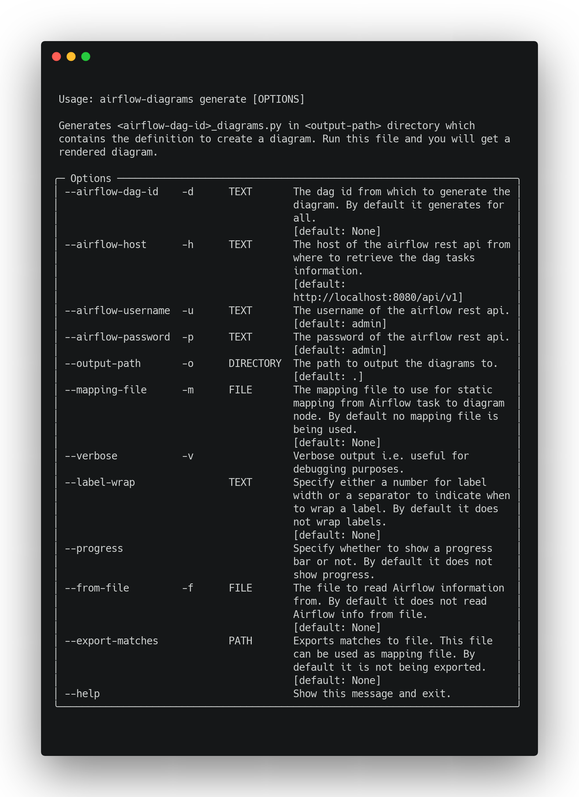

# airflow-diagrams

[](https://results.pre-commit.ci/latest/github/feluelle/airflow-diagrams/main)


[](https://codecov.io/gh/feluelle/airflow-diagrams)
[](https://pypi.org/project/airflow-diagrams/)
[](https://github.com/feluelle/airflow-diagrams/blob/main/LICENSE)
[](https://pypi.org/project/airflow-diagrams/)
[](https://pypi.org/project/airflow-diagrams/)

> Auto-generated Diagrams from Airflow DAGs. 🔮 🪄

This project aims to easily visualise your [Airflow](https://github.com/apache/airflow) DAGs on service level
from providers like AWS, GCP, Azure, etc. via [diagrams](https://github.com/mingrammer/diagrams).


Before | After
--- | ---
 | 

## 🚀 Get started

To install it from [PyPI](https://pypi.org/) run:

```console
pip install airflow-diagrams
```

> **_NOTE:_** Make sure you have [Graphviz](https://www.graphviz.org/) installed.

Then just call it like this:



_Examples of generated diagrams can be found in the [examples](examples) directory._

## 🤔 How it Works

1. ℹ️ It connects, by using the official [Apache Airflow Python Client](https://github.com/apache/airflow-client-python), to your Airflow installation to retrieve all DAGs (in case you don't specify any `dag_id`) and all Tasks for the DAG(s).
1. 🪄 It processes every DAG and its Tasks and 🔮 tries to find a diagram node for every DAGs task, by using [Fuzzy String Matching](https://github.com/seatgeek/thefuzz), that matches the most. If you are unhappy about the match you can also provide a `mapping.yml` file to statically map from Airflow task to diagram node.
1. 🎨 It renders the results into a python file which can then be executed to retrieve the rendered diagram. 🎉

## ❤️ Contributing

Contributions are very welcome. Please go ahead and raise an issue if you have one or open a PR. Thank you.
